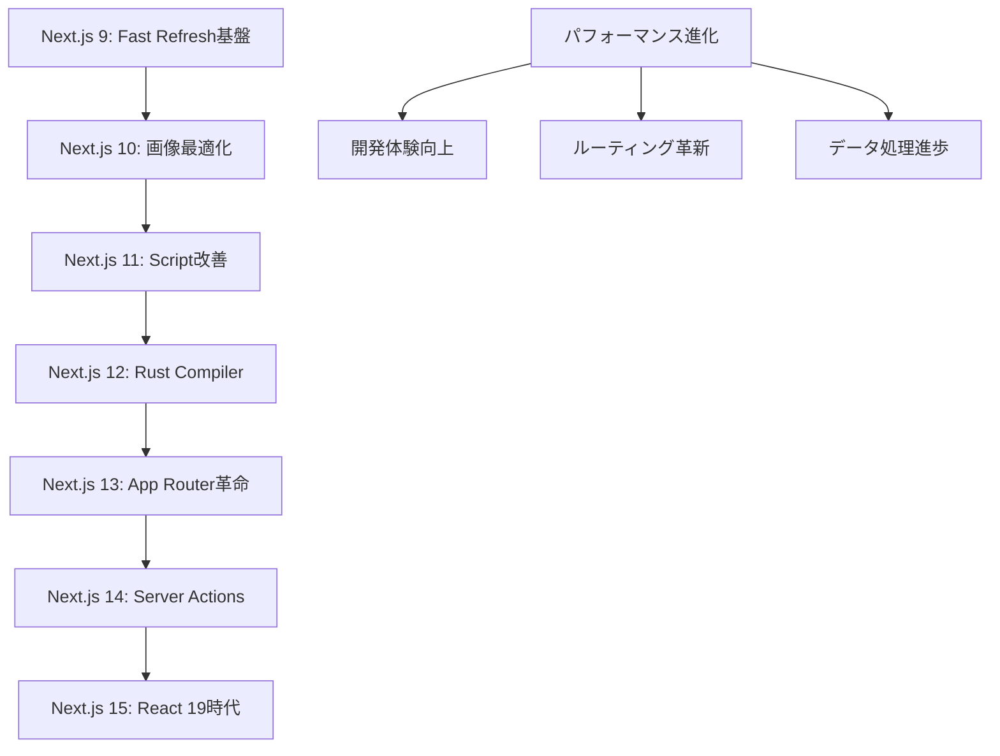

# Next.js - React フレームワーク

React をベースとした本格的なフルスタック Web アプリケーション開発フレームワーク。学習リソース、公式ドキュメント、技術ブログの包括的なコレクション。

## 📚 目次

1. [学習コース（Learn）](#学習コースlearn)
2. [公式ドキュメント（Docs）](#公式ドキュメントdocs)
3. [技術ブログ（Blog）](#技術ブログblog)
4. [Next.js 概要](#nextjs-概要)
5. [学習ロードマップ](#学習ロードマップ)

---

## 学習コース（Learn）

Next.js の公式学習プラットフォーム。初心者から実践的なフルスタック開発まで段階的に学習。

### 📖 [Next.js Learn Platform](./learn.md)

#### 学習コース構成

```typescript
interface NextJSLearnPlatform {
  reactFoundations: {
    chapters: 11;
    duration: "2-3週間";
    prerequisites: "HTML, CSS, JavaScript基礎";
    outcomes: "React基礎習得, Next.js移行準備";
  };
  dashboardApp: {
    chapters: 18;
    duration: "3-4週間";
    prerequisites: "React基礎理解";
    outcomes: "フルスタック財務ダッシュボード構築";
  };
  technologies: {
    frontend: "Next.js 14, TypeScript, Tailwind CSS";
    backend: "Server Actions, Server Components";
    database: "PostgreSQL (Vercel)";
    auth: "NextAuth.js";
    deployment: "Vercel";
  };
}
```

#### コース詳細

**🎯 [React基礎講座](./learn/react-foundations.md)**

```typescript
interface ReactFoundationsCourse {
  fundamentals: {
    "00-Introduction": "コース概要と前提知識";
    "01-React-NextJS": "Webアプリケーション構成要素";
    "02-Rendering-UI": "DOM理解とブラウザレンダリング";
    "03-Updating-UI": "JavaScript DOM操作実践";
  };
  reactCore: {
    "04-Getting-Started": "ReactのCDN導入とJSX";
    "05-Components": "コンポーネントシステム設計";
    "06-Props": "データ受け渡しとコンポーネント連携";
    "07-State": "useState()による状態管理";
  };
  nextjsTransition: {
    "08-React-to-NextJS": "アプリケーション統合";
    "09-Installation": "開発環境セットアップ";
    "10-Server-Client": "SSRとRSCの概念理解";
    "11-Next-Steps": "継続学習とリソース案内";
  };
}
```

**🚀 [Dashboard App 構築コース](./learn/dashboard-app.md)**

```typescript
interface DashboardAppCourse {
  foundation: {
    "00-Introduction": "プロジェクト概要と最終成果物";
    "01-Getting-Started": "Next.jsプロジェクト作成";
    "02-CSS-Styling": "Tailwind CSS設計パターン";
    "03-Fonts-Images": "最適化技術実装";
  };
  routing: {
    "04-Layouts-Pages": "ファイルシステムルーティング";
    "05-Navigation": "クライアントサイドナビゲーション";
  };
  dataLayer: {
    "06-Database-Setup": "PostgreSQL設計・接続";
    "07-Data-Fetching": "Server Components活用";
    "08-Rendering-Strategies": "静的・動的レンダリング";
  };
  performance: {
    "09-Streaming": "Suspenseによる段階的読み込み";
    "10-Partial-Prerendering": "PPR実験的機能";
  };
  features: {
    "11-Search-Pagination": "URL検索パラメータ活用";
    "12-Data-Mutation": "Server Actions CRUD操作";
  };
  production: {
    "13-Error-Handling": "エラー境界と例外処理";
    "14-Accessibility": "WCAG準拠UI実装";
    "15-Authentication": "NextAuth.js セキュリティ";
    "16-Metadata": "SEO最適化設定";
    "17-Next-Steps": "さらなる学習展開";
  };
}
```

#### 学習成果・スキル習得

```typescript
interface LearnSkillsAcquired {
  frontend: {
    react: "コンポーネント, Props, State, フック";
    nextjs: "App Router, Server Components, ルーティング";
    typescript: "型安全な開発環境";
    styling: "Tailwind CSS, レスポンシブデザイン";
  };
  backend: {
    serverActions: "サーバーサイドフォーム処理";
    dataFetching: "効率的なデータ取得戦略";
    authentication: "セキュアな認証・認可";
    database: "PostgreSQL スキーマ設計";
  };
  devops: {
    deployment: "Vercel CI/CD パイプライン";
    environment: "環境変数管理";
    performance: "Core Web Vitals 最適化";
    monitoring: "エラートラッキング";
  };
  professional: {
    accessibility: "包括的なUI設計";
    seo: "検索エンジン最適化";
    testing: "品質保証手法";
    collaboration: "チーム開発ワークフロー";
  };
}
```

---

## 公式ドキュメント（Docs）

Next.js の包括的な公式ドキュメント。APIリファレンス、実装ガイド、アーキテクチャ解説。

### 📚 [Next.js Official Documentation](./docs.md)

#### ドキュメント構成

```typescript
interface NextJSDocumentation {
  appRouter: {
    coverage: "50+ セクション, 100+ 実例, 200+ コードスニペット";
    structure: "学習→実践→APIリファレンス";
    depth: "基礎概念から本格実装まで";
  };
  architecture: {
    performance: "Fast Refresh, Turbopack, SWC Compiler";
    accessibility: "WCAG準拠, ESLint統合";
    compatibility: "モダンブラウザサポート";
  };
  community: {
    contribution: "ドキュメント貢献ガイドライン";
    tools: "実験的ツール(Rspack等)";
    support: "Discord, GitHub Discussions";
  };
}
```

#### 主要ドキュメントセクション

**📖 [App Router 総合ドキュメント](./docs/app.md)**

```typescript
interface AppRouterDocumentation {
  gettingStarted: {
    installation: "プロジェクト作成・環境構築";
    projectStructure: "ディレクトリ構造とファイル規約";
    layoutsPages: "ネストレイアウトとページ設計";
    routing: "ファイルシステムルーティング理解";
  };
  practicalGuides: {
    dataFetching: "Server/Client Components活用";
    authentication: "NextAuth.js セキュリティ実装";
    performance: "画像・フォント最適化戦略";
    deployment: "Vercel本番デプロイ";
  };
  apiReference: {
    runtime: "Edge Runtime, Node.js Runtime";
    components: "Image, Link, Script最適化";
    functions: "35+ サーバー・クライアント関数";
    configuration: "next.config.js 58+ オプション";
  };
}
```

**🏗️ [アーキテクチャ・技術基盤](./docs/architecture.md)**

```typescript
interface NextJSArchitecture {
  fastRefresh: {
    performance: "1秒以内コンポーネント更新";
    statePreservation: "編集中状態保持";
    errorRecovery: "自動エラー回復";
    zeroConfig: "設定不要デフォルト有効";
  };
  swcCompiler: {
    technology: "Rust製高速JavaScript/TypeScript処理";
    performance: "Babel比3-5倍高速化";
    memory: "メモリ使用量大幅削減";
    features: "JSX変換, ミニファイ, バンドル最適化";
  };
  accessibility: {
    eslintIntegration: "eslint-plugin-jsx-a11y自動適用";
    wcagCompliance: "WCAG準拠自動検証";
    developmentSupport: "問題即座検出・修正提案";
  };
  browserSupport: {
    modernBrowsers: "ES2017+サポート";
    automaticPolyfills: "必要時自動注入";
    progressiveEnhancement: "段階的機能向上";
  };
}
```

**🤝 [コミュニティ・貢献ガイド](./docs/community.md)**

```typescript
interface CommunityContribution {
  documentationGuidelines: {
    fileStructure: "2桁プレフィックス順序管理";
    writingStyle: "簡潔・具体的・アクティブボイス";
    codeBlocks: "TypeScript使用, ファイル名指定";
    qualityStandards: "Grammarly, MDX preview, ローカルテスト";
  };
  githubWorkflow: {
    pullRequestLifecycle: "Open → Triage → Approval & Merge";
    reviewProcess: "Next.jsチーム専門レビュー";
    deploymentSpeed: "承認後数分以内デプロイ";
  };
  experimentalTools: {
    rspack: "Rust製高速バンドラー(実験的)";
    communityProjects: "コミュニティ主導イノベーション";
    feedback: "GitHub Discussions フィードバック";
  };
}
```

---

## 技術ブログ（Blog）

Next.js の技術進化、設計思想、実装解説を深く理解するための公式ブログ記事集。

### 📝 [Next.js Official Blog](./blog.md)

#### ブログ構成

```typescript
interface NextJSBlog {
  versionReleases: {
    latest: "Next.js 15 (React 19, Turbopack安定化)";
    major: "13(App Router革命), 14(Server Actions), 15(最新)";
    coverage: "全バージョン系統的カバレッジ";
  };
  technicalDeepDives: {
    security: "セキュリティモデル, ベストプラクティス";
    caching: "'use cache'新ディレクティブ";
    architecture: "内部実装, 設計思想";
  };
  toolingEvolution: {
    turbopack: "Rust製バンドラー進化";
    compiler: "SWC統合, パフォーマンス改善";
    devExperience: "開発者体験向上軌跡";
  };
}
```

#### 主要記事カテゴリ

**🚀 最新バージョンリリース**

```typescript
interface VersionReleases {
  nextjs15: {
    date: "2024年10月21日";
    highlights: {
      automation: "@next/codemod自動アップグレード";
      performance: "Turbopack 76.7%高速化";
      breaking: "非同期Request APIs";
      react19: "正式サポート + Compiler統合";
    };
  };
  nextjs14: {
    date: "2023年10月26日";
    highlights: {
      turbopack: "5,000+テスト合格, 53%高速化";
      serverActions: "安定版リリース";
      ppr: "Partial Prerendering プレビュー";
      education: "新学習コース提供";
    };
  };
  nextjs13: {
    date: "2022年10月25日";
    highlights: {
      appDirectory: "革命的App Router(ベータ)";
      turbopack: "700倍高速Rust製バンドラー(アルファ)";
      optimization: "next/image, next/font改善";
    };
  };
}
```

**🔒 技術解説・セキュリティ**

```typescript
interface TechnicalArticles {
  security: {
    article: "Next.jsセキュリティ考察";
    author: "Sebastian Markbåge";
    approaches: {
      httpApis: "ゼロトラスト + 既存バックエンド";
      dataAccessLayer: "内部ライブラリ + 認証統合";
      componentLevel: "プロトタイピング限定";
    };
  };
  caching: {
    article: "構成可能なキャッシング";
    innovation: "'use cache'ディレクティブ";
    benefits: "自動依存関係管理, 安全なキー生成";
  };
  architecture: {
    rfc: "レイアウトRFC - App Router設計思想";
    adoption: "段階的導入戦略(3アプローチ)";
    evolution: "技術進化トレンド分析";
  };
}
```

**⚡ 開発ツール・体験**

```typescript
interface DeveloperExperience {
  turbopack: {
    status: "開発ビルド安定版(2024年10月)";
    performance: "最大96.3%高速化";
    roadmap: "永続キャッシング → 本番ビルド → デフォルト化";
  };
  fastRefresh: {
    concept: "瞬間的開発フィードバック";
    features: "状態保持, エラー自動回復";
    compatibility: "Reactコンポーネント最適化";
  };
  migration: {
    strategies: "段階的導入3パターン";
    tooling: "自動化codemod, 移行支援";
    compatibility: "破壊的変更最小化";
  };
}
```

#### バージョン進化トレンド



---

## Next.js 概要

### 🎯 フレームワーク特徴

#### 核心価値提案

```typescript
interface NextJSCoreValue {
  developerExperience: {
    zeroConfig: "設定不要で即座に開発開始";
    fastRefresh: "瞬時フィードバック開発体験";
    typescript: "ファーストクラスTypeScriptサポート";
    tooling: "ESLint, Prettier統合";
  };
  performance: {
    automaticOptimization: "画像・フォント・バンドル自動最適化";
    rendering: "SSG, SSR, ISR柔軟なレンダリング";
    caching: "インテリジェントキャッシング戦略";
    coreWebVitals: "Core Web Vitals最適化";
  };
  scalability: {
    serverComponents: "サーバーサイドReactコンポーネント";
    appRouter: "ファイルシステムベースルーティング";
    serverActions: "サーバーサイドフォーム処理";
    middleware: "エッジでのリクエスト処理";
  };
  ecosystem: {
    vercelIntegration: "シームレスなデプロイ体験";
    communityPlugins: "豊富なプラグインエコシステム";
    enterpriseReady: "大規模アプリケーション対応";
  };
}
```

#### 技術アーキテクチャ

```typescript
interface NextJSTechnicalArchitecture {
  rendering: {
    serverComponents: "HTMLサーバーサイド生成";
    clientComponents: "インタラクティブクライアントサイド";
    hybridApproach: "最適なパフォーマンス組み合わせ";
  };
  routing: {
    fileSystemBased: "直感的なファイル構造ルーティング";
    nestedLayouts: "階層的レイアウト設計";
    parallelRoutes: "並列ルート処理";
    interceptingRoutes: "ルートインターセプト";
  };
  dataFetching: {
    serverActions: "型安全なサーバーサイド処理";
    streamingSSR: "段階的コンテンツ配信";
    staticGeneration: "ビルド時事前生成";
    incrementalRegeneration: "増分静的再生成";
  };
  optimization: {
    imageOptimization: "自動画像処理・配信";
    fontOptimization: "Webフォント最適化";
    bundleAnalyzer: "バンドルサイズ可視化";
    treeShaking: "未使用コード除去";
  };
}
```

### 🛠️ 開発エコシステム

#### ツールチェーン統合

```typescript
interface NextJSToolchain {
  buildSystem: {
    turbopack: "Rust製超高速バンドラー";
    swc: "高速JavaScript/TypeScriptコンパイラ";
    webpack: "従来のWebpack互換性";
  };
  development: {
    fastRefresh: "Hot Module Replacement進化版";
    errorOverlay: "詳細エラー表示";
    devtools: "React DevTools統合";
  };
  testing: {
    jest: "ビルトインテストフレームワーク";
    cypress: "E2Eテストサポート";
    playwright: "クロスブラウザテスト";
  };
  deployment: {
    vercel: "ゼロ設定デプロイ";
    selfHosted: "Node.js環境デプロイ";
    staticExport: "静的サイトエクスポート";
    docker: "コンテナ化サポート";
  };
}
```

---

## 学習ロードマップ

### 🎯 段階的学習パス

#### Phase 1: 基礎固め（2-3週間）

```typescript
interface FoundationPhase {
  prerequisites: {
    javascript: "ES6+, async/await, モジュール";
    react: "コンポーネント, Props, State, フック";
    webDevelopment: "HTML5, CSS3, HTTP基礎";
  };
  learning: {
    course: "React基礎講座(learn/react-foundations.md)";
    focus: "React概念習得, Next.js移行準備";
    outcome: "シンプルなReactアプリケーション構築";
  };
  practice: {
    projects: "Todo App, 個人ポートフォリオ";
    skills: "コンポーネント設計, 状態管理";
  };
}
```

#### Phase 2: Next.js 実践（3-4週間）

```typescript
interface PracticalPhase {
  learning: {
    course: "Dashboard App構築(learn/dashboard-app.md)";
    documentation: "App Router基礎(docs/app.md)";
    focus: "フルスタック開発, データベース統合";
  };
  skills: {
    routing: "ファイルシステムルーティング";
    dataFetching: "Server Components, Server Actions";
    authentication: "NextAuth.js実装";
    styling: "Tailwind CSS, レスポンシブ";
  };
  outcome: {
    project: "財務ダッシュボードアプリケーション";
    deployment: "Vercel本番デプロイ";
  };
}
```

#### Phase 3: 最適化・本番対応（2-3週間）

```typescript
interface OptimizationPhase {
  learning: {
    documentation: "アーキテクチャ詳細(docs/architecture.md)";
    blog: "技術解説記事(blog.md)";
    focus: "パフォーマンス, セキュリティ, 運用";
  };
  skills: {
    performance: "Core Web Vitals最適化";
    security: "セキュアなデータ処理";
    accessibility: "WCAG準拠UI";
    monitoring: "エラートラッキング";
  };
  outcome: {
    expertise: "本番品質アプリケーション開発";
    contribution: "コミュニティ参加・貢献";
  };
}
```

#### Phase 4: 継続的学習・専門化（継続的）

```typescript
interface ContinuousLearning {
  specialization: {
    performance: "Turbopack, 最適化手法";
    architecture: "大規模アプリケーション設計";
    devops: "CI/CD, インフラ管理";
    innovation: "実験的機能検証";
  };
  community: {
    contribution: "ドキュメント改善";
    mentoring: "新規学習者サポート";
    speaking: "技術プレゼンテーション";
    blogging: "技術記事執筆";
  };
  careerDevelopment: {
    seniorDeveloper: "技術リーダーシップ";
    architect: "システム設計専門家";
    consultant: "技術コンサルティング";
    entrepreneur: "技術系起業";
  };
}
```

### 📊 学習効果測定

#### スキルレベル評価

```typescript
interface SkillAssessment {
  beginner: {
    criteria: "HTML/CSS基礎, JavaScript変数・関数";
    path: "React基礎 → Next.js入門";
    duration: "2-3ヶ月";
    milestone: "静的サイト構築";
  };
  intermediate: {
    criteria: "React基礎, コンポーネント設計経験";
    path: "App Router → フルスタック開発";
    duration: "3-4ヶ月";
    milestone: "動的Webアプリケーション";
  };
  advanced: {
    criteria: "フルスタック経験, Next.js基礎知識";
    path: "最適化 → アーキテクチャ";
    duration: "継続的";
    milestone: "企業級アプリケーション";
  };
  expert: {
    criteria: "本番運用経験, 技術リーダーシップ";
    path: "イノベーション → コミュニティ貢献";
    duration: "継続的";
    milestone: "技術的影響力";
  };
}
```

### 🔄 学習サイクル最適化

#### 効果的学習戦略

```typescript
interface LearningStrategy {
  theoryPracticeBalance: {
    ratio: "30% 理論学習 : 70% 実践開発";
    approach: "概念理解 → 即座実装 → 反復改善";
  };
  projectBasedLearning: {
    progression: "個人プロジェクト → チーム開発 → OSS貢献";
    complexity: "シンプル → 中規模 → 企業級";
  };
  communityEngagement: {
    participation: "Discord質問 → GitHub議論 → 技術発表";
    contribution: "ドキュメント → コード → アーキテクチャ";
  };
  continuousImprovement: {
    review: "週次振り返り, 月次目標設定";
    update: "最新技術トレンド追跡";
    mentoring: "他者教育による理解深化";
  };
}
```

この包括的なドキュメントにより、Next.js の学習から実践、コミュニティ参加まで一貫した成長パスを提供します。初心者から上級者まで、各段階で必要なリソースと実践的な学習体験を通じて、現代的な Web 開発のエキスパートを目指せます。
