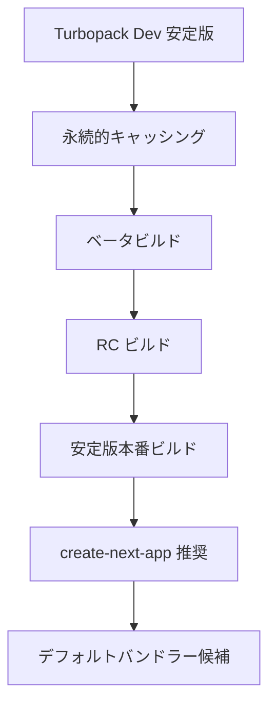
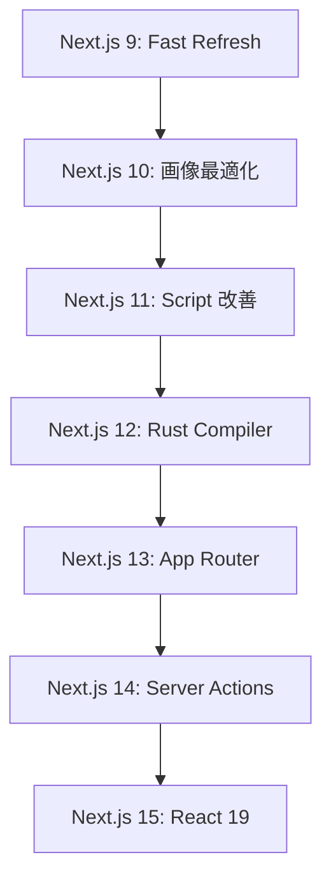

# Next.js Blog - 公式ブログ記事集

Next.jsの公式ブログ記事の包括的なコレクション。バージョンリリース、技術解説、アーキテクチャ設計に関する最新情報と深い洞察を提供します。

## 📚 目次

1. [最新バージョンリリース](#最新バージョンリリース)
2. [技術解説・アーキテクチャ](#技術解説アーキテクチャ)
3. [開発体験・ツール](#開発体験ツール)
4. [バージョン履歴](#バージョン履歴)

---

## 最新バージョンリリース

Next.jsの主要バージョンリリースと重要なアップデート情報。

### 🚀 Next.js 15 世代（2024年〜）

#### 📝 [Next.js 15](./blog/next-15.md)

**公開日**: 2024年10月21日 | **著者**: Delba de Oliveira, Jimmy Lai, Rich Haines

**主要ハイライト**:

```typescript
interface NextJS15Features {
  automation: {
    codemod: "@next/codemod CLI による自動アップグレード";
    migration: "React 19 への段階的移行支援";
  };
  performance: {
    turbopack: "Turbopack Dev 安定版リリース";
    startup: "ローカルサーバー起動 76.7% 高速化";
    fastRefresh: "コード更新 96.3% 高速化";
  };
  breaking: {
    asyncApis: "cookies(), headers(), params の非同期化";
    caching: "GET Route Handlers キャッシング無効化";
    clientRouter: "Client Router Cache 最新データ反映";
  };
  react19: {
    support: "React 19 RC 正式サポート";
    compiler: "React Compiler (実験的) 統合";
    compatibility: "Pages Router React 18 互換性維持";
  };
}
```

**アップグレード手順**:

```bash
# 自動アップグレード（推奨）
npx @next/codemod@canary upgrade latest

# 手動アップグレード
npm install next@latest react@rc react-dom@rc
```

#### 📝 [Next.js 15.5](./blog/next-15-5.md) - 最新パッチ

- パフォーマンス改善とバグ修正
- 実験的機能の安定性向上
- TypeScript 5.x サポート強化

### 🌟 Next.js 14 世代（2023年〜）

#### 📝 [Next.js 14](./blog/next-14.md)

**公開日**: 2023年10月26日 | **著者**: Lee Robinson, Tim Neutkens

**革新的機能**:

```typescript
interface NextJS14Features {
  turbopack: {
    performance: "ローカル起動 53% 高速化";
    fastRefresh: "コード更新 94% 高速化";
    testing: "5,000+ テスト合格";
  };
  serverActions: {
    stability: "Server Actions 安定版リリース";
    integration: "キャッシング・再検証統合";
    forms: "プログレッシブ強化ミューテーション";
  };
  ppr: {
    concept: "Partial Prerendering (プレビュー)";
    benefits: "高速初期レスポンス + 動的コンテンツ";
    foundation: "React Suspense ベース実装";
  };
  education: {
    course: "新 Next.js 学習コース";
    coverage: "App Router, 認証, データベース";
    accessibility: "無料オンライン提供";
  };
}
```

#### 📝 [Next.js 14.2](./blog/next-14-2.md)

- Turbopack さらなる最適化
- DX（開発者体験）改善
- メモリ使用量削減

### 🎯 Next.js 13 世代（2022年〜）

#### 📝 [Next.js 13](./blog/next-13.md)

**公開日**: 2022年10月25日 | **大規模チーム開発**

**歴史的転換点**:

```typescript
interface NextJS13Revolution {
  appDirectory: {
    status: "ベータ版導入";
    features: "レイアウト, Server Components, ストリーミング";
    philosophy: "より簡単, 高速, 少ないクライアントJS";
  };
  turbopack: {
    technology: "Rust ベース webpack 代替";
    performance: "最大 700倍 高速化";
    status: "アルファ版";
  };
  optimization: {
    nextImage: "ネイティブブラウザ遅延読み込み";
    nextFont: "ゼロレイアウトシフト自動フォント";
    nextLink: "自動 <a> タグ簡素化 API";
  };
}
```

---

## 技術解説・アーキテクチャ

Next.jsの深い技術的理解のための解説記事集。

### 🔒 セキュリティ・ベストプラクティス

#### 📝 [Next.js セキュリティ考察](./blog/security-nextjs-server-components-actions.md)

**公開日**: 2023年10月23日 | **著者**: Sebastian Markbåge

**セキュリティアーキテクチャ**:

```typescript
interface NextJSSecurityModels {
  httpApis: {
    approach: "ゼロトラストネットワーク原則";
    usage: "fetch() による API エンドポイント呼び出し";
    benefit: "既存バックエンドチーム活用";
    recommendation: "大規模既存プロジェクト向け";
  };
  dataAccessLayer: {
    approach: "内部 JavaScript ライブラリ作成";
    integration: "データアクセスチェック統合";
    principle: "全 API でユーザー認証確認";
    recommendation: "新規プロジェクト向け";
  };
  componentLevel: {
    approach: "Server Components 直接 DB クエリ";
    caution: "'use client' ファイル慎重監査必要";
    recommendation: "プロトタイピング限定";
  };
}
```

**セキュリティ実装パターン**:

```typescript
// Data Access Layer パターン
export async function getUser(userId: string) {
  // 現在のユーザー認証チェック
  const currentUser = await auth()
  if (!currentUser || !canAccessUser(currentUser, userId)) {
    throw new UnauthorizedError()
  }
  return db.user.findUnique({ where: { id: userId } })
}

// Server Component セキュリティ実装
import 'server-only'  // クライアント漏洩防止

export default async function UserProfile({ userId }: { userId: string }) {
  const user = await getUser(userId)  // アクセス制御含む
  return <div>{user.name}</div>
}
```

### 💾 キャッシング戦略

#### 📝 [構成可能なキャッシング](./blog/composable-caching.md)

**公開日**: 2025年1月3日 | **著者**: Lee Robinson

**新しい `'use cache'` ディレクティブ**:

```typescript
interface UseCacheFeatures {
  automation: {
    dependencies: "キャッシュ依存関係自動決定";
    keyGeneration: "安全なキャッシュキー生成";
    conflictPrevention: "キャッシュ衝突防止";
  };
  serialization: {
    serializable: "安定文字列形式変換";
    nonSerializable: "サーバー参照置換";
    safetyHandling: "複雑クロージャー安全管理";
  };
  performance: {
    staticAnalysis: "コンパイル時静的分析";
    runtimeOverhead: "ランタイムオーバーヘッド削減";
    automaticOptimization: "自動最適化適用";
  };
}
```

**実装例**:

```typescript
// 基本的な使用例
async function getUser(id: string) {
  "use cache";
  const response = await fetch(`https://api.vercel.app/user/${id}`);
  return response.json();
}

// 複雑なキャッシング
async function getRecommendations(user: User, preferences: Preferences) {
  "use cache";
  // シリアライズ可能な値: 自動キャッシュキー生成
  // シリアライズ不可能な値: サーバー参照に変換
  return await recommendationEngine.compute(user, preferences);
}
```

### 📊 ジャーニー・事例研究

#### 📝 [キャッシングの歩み](./blog/our-journey-with-caching.md)

- Next.jsのキャッシング戦略進化
- パフォーマンス最適化の歴史
- 実際のアプリケーションでの効果測定

---

## 開発体験・ツール

開発者体験向上のためのツールとワークフロー改善。

### ⚡ Turbopack 開発

#### 📝 [Turbopack Dev 安定版](./blog/turbopack-for-development-stable.md)

**公開日**: 2024年10月21日 | **著者**: Maia Teegarden, Tim Neutkens, Tobias Koppers

**パフォーマンス革命**:

```typescript
interface TurbopackStableMetrics {
  performance: {
    serverStartup: "最大 76.7% 高速化";
    fastRefresh: "最大 96.3% 高速化";
    initialCompile: "最大 45.8% 高速化";
  };
  compatibility: {
    testPassing: "99.8% テスト合格";
    cssSupport: "ほぼ全 CSS・CSS-in-JS ライブラリ";
    routerSupport: "App Router & Pages Router 両対応";
  };
  architecture: {
    foundation: "Rust ベース高速実行";
    incrementalAdoption: "最小破壊的変更";
    futureProof: "将来イノベーション基盤";
  };
}
```

**開発ロードマップ**:



#### 📝 [Webpack メモリ最適化](./blog/webpack-memory.md)

- メモリ使用量削減技術
- 大規模プロジェクトでの実装戦略
- パフォーマンス監視ベストプラクティス

### 🎨 スタイリング・UI

#### 📝 [Styled JSX によるスタイリング](./blog/styling-next-with-styled-jsx.md)

- CSS-in-JS の Next.js 統合
- スコープ付きスタイルの実装
- パフォーマンス考慮事項

### 🏗️ 設計・RFC

#### 📝 [レイアウト RFC](./blog/layouts-rfc.md)

**公開日**: 2022年5月23日 | **著者**: Delba de Oliveira, Lee Robinson, Sebastian Markbåge, Tim Neutkens

**App Router 設計思想**:

```typescript
interface LayoutsRFCVision {
  motivation: {
    limitations: "現在ルーティング制限への対応";
    improvement: "レイアウト作成体験向上";
    complexity: "ダッシュボード・コンソール複雑ルーティング";
    futureProof: "React 未来との整合性";
  };
  features: {
    nestedLayouts: "ネストレイアウト";
    serverComponents: "デフォルト Server Components";
    dataFetching: "改善データフェッチング";
    react18: "React 18 機能統合";
  };
  adoption: {
    incremental: "100% 段階的採用可能";
    parallel: "pages ディレクトリ並行動作";
    migration: "破壊的変更最小化";
  };
}
```

### 🔄 導入戦略

#### 📝 [段階的導入戦略](./blog/incremental-adoption.md)

**公開日**: 2020年11月18日 | **著者**: Lee Robinson

**導入アプローチ**:

```typescript
interface IncrementalAdoptionStrategies {
  subpath: {
    method: "サブパス戦略";
    configuration: "basePath 設定活用";
    example: "example.com/store → Next.js eCommerce";
    useCase: "特定機能モダナイゼーション";
  };
  rewrites: {
    method: "リライト戦略";
    configuration: "next.config.js rewrites";
    example: "ルートドメイン選択的ルーティング";
    useCase: "既存アプリとの並行運用";
  };
  microfrontends: {
    method: "モノレポ + サブドメイン";
    architecture: "マイクロフロントエンド";
    benefits: "スケーラブル自律チーム";
    useCase: "大規模組織・複数チーム";
  };
}
```

---

## バージョン履歴

Next.jsの全バージョンリリース履歴。

### 📈 メジャーバージョン系統

#### Next.js 15.x シリーズ（2024年10月〜）

- **[15.0](./blog/next-15.md)** - React 19, Turbopack Dev 安定化, 非同期 Request APIs
- **[15.1](./blog/next-15-1.md)** - バグ修正, パフォーマンス改善
- **[15.2](./blog/next-15-2.md)** - TypeScript 強化, 実験的機能改善
- **[15.3](./blog/next-15-3.md)** - セキュリティアップデート
- **[15.4](./blog/next-15-4.md)** - DX 改善, エラーハンドリング向上
- **[15.5](./blog/next-15-5.md)** - 最新安定化パッチ

#### Next.js 14.x シリーズ（2023年10月〜2024年9月）

- **[14.0](./blog/next-14.md)** - Turbopack 改善, Server Actions 安定版, PPR プレビュー
- **[14.1](./blog/next-14-1.md)** - DX 向上, バグ修正
- **[14.2](./blog/next-14-2.md)** - パフォーマンス最適化, メモリ使用量削減

#### Next.js 13.x シリーズ（2022年10月〜2023年9月）

- **[13.0](./blog/next-13.md)** - App Directory (ベータ), Turbopack (アルファ), `@next/font`
- **[13.1](./blog/next-13-1.md)** - App Directory 改善
- **[13.2](./blog/next-13-2.md)** - ビルトイン SEO サポート
- **[13.3](./blog/next-13-3.md)** - File-based メタデータ API
- **[13.4](./blog/next-13-4.md)** - App Router (安定版)
- **[13.5](./blog/next-13-5.md)** - 最終 13.x パッチ

#### Next.js 12.x シリーズ（2021年10月〜2022年9月）

- **[12.0](./blog/next-12.md)** - Rust Compiler, ミドルウェア, React 18 サポート
- **[12.1](./blog/next-12-1.md)** - SWC ミニファイ, Styled Components サポート
- **[12.2](./blog/next-12-2.md)** - Edge API Routes, ESM サポート
- **[12.3](./blog/next-12-3.md)** - Static Export, OG 画像生成

#### Next.js 11.x シリーズ（2021年6月〜2021年9月）

- **[11.0](./blog/next-11.md)** - Conformance, Script コンポーネント改善
- **[11.1](./blog/next-11-1.md)** - ES Modules サポート, Image プレースホルダー

#### Next.js 10.x シリーズ（2020年10月〜2021年5月）

- **[10.0](./blog/next-10.md)** - 自動画像最適化, 国際化, Analytics
- **[10.1](./blog/next-10-1.md)** - 3x Faster Refresh, Sass サポート改善
- **[10.2](./blog/next-10-2.md)** - 自動 Polyfill 最適化

#### Next.js 9.x シリーズ（2019年7月〜2020年9月）

- **[9.0](./blog/next-9.md)** - TypeScript サポート, API Routes, Dynamic Imports
- **[9.1](./blog/next-9-1.md)** - Built-in Zero-Config TypeScript
- **[9.2](./blog/next-9-2.md)** - Built-in CSS サポート
- **[9.3](./blog/next-9-3.md)** - Next.js Analytics, Sass サポート
- **[9.4](./blog/next-9-4.md)** - Fast Refresh, 増分静的再生成
- **[9.5](./blog/next-9-5.md)** - 安定版 TypeScript, AVIF サポート

#### レガシーバージョン

- **[8.x シリーズ](./blog/next-8.md)** - Serverless サポート, Dynamic Imports
- **[7.x シリーズ](./blog/next-7.md)** - React Context, DynamicImports
- **[6.x シリーズ](./blog/next-6.md)** - Runtime サイズ削減
- **[5.x シリーズ](./blog/next-5.md)** - Universal Webpack, 改善された開発体験

### 🎯 特別記事・技術深掘り

#### API・開発ツール

- **[API 構築ガイド](./blog/building-apis-with-nextjs.md)** - Next.js での効果的な API 設計
- **[create-next-app 改善](./blog/create-next-app.md)** - プロジェクト作成ツール進化

#### アップデート・状況報告

- **[2023年6月アップデート](./blog/june-2023-update.md)** - 中間報告・ロードマップ更新

---

## ブログ活用ガイド

### 🎯 読者別推奨記事

#### 🟢 初心者・入門者

```typescript
interface BeginnerPath {
  start: "段階的導入戦略で概念理解";
  foundation: "Next.js 13-15 メジャーリリース順読";
  practical: "具体的実装例で実践学習";
  timeline: "2-3週間で基礎固め";
}
```

#### 🟡 中級者・実装者

```typescript
interface IntermediatePath {
  architecture: "セキュリティ・キャッシング技術記事";
  performance: "Turbopack・最適化手法";
  migration: "バージョンアップグレード戦略";
  timeline: "1-2ヶ月で実践スキル習得";
}
```

#### 🔴 上級者・コントリビューター

```typescript
interface AdvancedPath {
  rfc: "レイアウト RFC 等設計思想理解";
  experimental: "実験的機能検証・フィードバック";
  community: "技術記事執筆・コミュニティ貢献";
  timeline: "継続的学習・業界動向追跡";
}
```

### 📊 技術トレンド分析

#### 主要技術テーマの進化



#### 開発者体験の向上軌跡

1. **パフォーマンス**: Fast Refresh → Turbopack → React Compiler
2. **ルーティング**: Pages Router → App Router → Layouts
3. **データ処理**: getStaticProps → Server Components → Server Actions
4. **最適化**: 手動 → 自動画像・フォント → AI支援

このブログコレクションにより、Next.jsの技術進化と設計思想を包括的に理解し、最新の開発手法を効率的に学習できます。各記事は実践的な実装例と深い技術解説を提供し、初心者から上級者まで価値ある洞察を得られる構成となっています。
