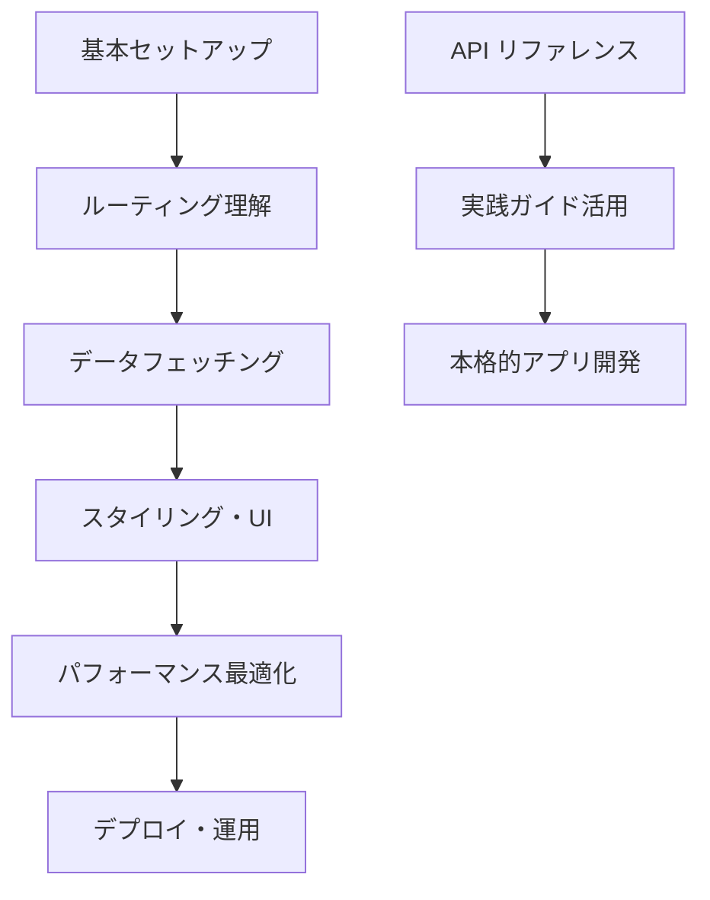
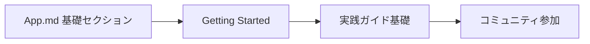
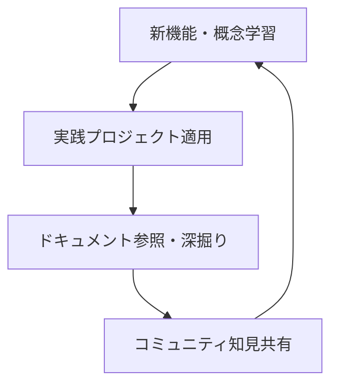

# Next.js Docs - 公式ドキュメント

Next.js App Router の包括的な公式ドキュメント集。開発者が効率的にNext.jsを学習・活用できるよう、基礎概念から実践的な実装まで体系的に整理されています。

## 📚 目次

1. [App Router ドキュメント](#app-router-ドキュメント)
2. [アーキテクチャ・技術基盤](#アーキテクチャ技術基盤)
3. [コミュニティ・貢献ガイド](#コミュニティ貢献ガイド)
4. [ドキュメント活用法](#ドキュメント活用法)

---

## App Router ドキュメント

Next.js 13+の新しいApp Routerに関する包括的なドキュメント集。学習から本格実装まで段階的にサポート。

### 📖 [Next.js App Router 総合ドキュメント](./docs/app.md)

#### ドキュメント構成概要

```typescript
interface AppRouterDocs {
  learning: {
    gettingStarted: "基礎から応用まで段階的学習";
    practicalGuides: "実践的な実装ガイド集";
    apiReference: "完全APIリファレンス";
  };
  structure: {
    installation: "プロジェクト作成・環境構築";
    coreFeatures: "ルーティング・レンダリング・データ処理";
    advanced: "パフォーマンス・セキュリティ・デプロイ";
  };
  coverage: {
    totalSections: 50;
    practicalExamples: 100;
    codeSnippets: 200;
  };
}
```

#### 主要セクション詳細

**🚀 Getting Started セクション**

- **[基本セットアップ](./docs/app/getting-started.md)** - プロジェクト作成から開発環境構築
- **[プロジェクト構造](./docs/app/getting-started/01-project-structure.md)** - App Router ディレクトリ構造とファイル規約
- **[レイアウト・ページ設計](./docs/app/getting-started/02-layouts-and-pages.md)** - ネストレイアウトとページコンポーネント
- **[ルーティング基礎](./docs/app/getting-started/03-routing-fundamentals.md)** - ファイルシステムルーティングの理解

**🛠️ 実践ガイド セクション**

- **[実装ガイド集](./docs/app/guides.md)** - パフォーマンス、セキュリティ、デプロイの実践的手法
- **[データフェッチング](./docs/app/guides/data-fetching.md)** - Server Components、Client Components、データキャッシュ
- **[認証・セキュリティ](./docs/app/guides/authentication.md)** - NextAuth.js、JWT、ミドルウェア
- **[パフォーマンス最適化](./docs/app/guides/performance.md)** - 画像・フォント最適化、バンドル分析

**📚 API リファレンス セクション**

- **[完全APIリファレンス](./docs/app/api-reference.md)** - 関数、コンポーネント、設定の網羅的解説
- **[ランタイムAPI](./docs/app/api-reference/runtime.md)** - Edge Runtime、Node.js Runtime
- **[コンポーネントAPI](./docs/app/api-reference/components.md)** - Image、Link、Script等の最適化コンポーネント
- **[設定リファレンス](./docs/app/api-reference/config.md)** - next.config.js の全設定オプション

#### 学習パス推奨



#### 実装パターン例

```typescript
// App Router 基本構造
// app/layout.tsx - ルートレイアウト
export default function RootLayout({
  children,
}: {
  children: React.ReactNode
}) {
  return (
    <html lang="ja">
      <body>
        <Navigation />
        <main>{children}</main>
        <Footer />
      </body>
    </html>
  )
}

// app/dashboard/page.tsx - ページコンポーネント
import { Suspense } from 'react'
import { UserProfile } from './components/user-profile'

export default function DashboardPage() {
  return (
    <div>
      <h1>ダッシュボード</h1>
      <Suspense fallback={<div>読み込み中...</div>}>
        <UserProfile />
      </Suspense>
    </div>
  )
}

// Server Actions を使用したデータ変更
'use server'
export async function createUser(formData: FormData) {
  const name = formData.get('name') as string
  // データベース処理
  await db.user.create({ data: { name } })
  revalidatePath('/users')
}
```

---

## アーキテクチャ・技術基盤

Next.jsの内部アーキテクチャと技術的特徴に関する詳細ドキュメント。

### 🏗️ [Next.js アーキテクチャ解説](./docs/architecture.md)

#### 技術基盤概要

```typescript
interface NextjsArchitecture {
  performance: {
    fastRefresh: "瞬間的な開発体験";
    compiler: "Rust/SWC 高速コンパイル";
    optimization: "自動画像・フォント最適化";
  };
  accessibility: {
    eslint: "アクセシビリティ ルール統合";
    semanticHtml: "セマンティックHTML推奨";
    screenReader: "スクリーンリーダー対応";
  };
  compatibility: {
    browsers: "モダンブラウザサポート";
    polyfills: "自動ポリフィル注入";
    progressive: "プログレッシブエンハンスメント";
  };
}
```

#### 核心技術解説

**⚡ Fast Refresh（高速開発体験）**

- **[Fast Refresh詳細](./docs/architecture/02-fast-refresh.md)**
- **特徴**: 1秒以内のコンポーネント更新、状態保持、エラー自動回復
- **対応範囲**: Reactコンポーネント、フック、カスタムコンポーネント
- **制限事項**: クラスコンポーネント、高階コンポーネントの一部制約

```typescript
// Fast Refresh 対応例
export default function Counter() {
  const [count, setCount] = useState(0)
  // この変更は即座に反映、countの状態は保持される
  return (
    <button onClick={() => setCount(c => c + 1)}>
      カウント: {count}  {/* UI更新が瞬時に反映 */}
    </button>
  )
}
```

**🦀 Next.js Compiler（SWC統合）**

- **[コンパイラ詳細](./docs/architecture/03-nextjs-compiler.md)**
- **技術**: Rust製SWCによる高速JavaScript/TypeScriptコンパイル
- **機能**: JSX変換、TypeScript処理、ミニファイ、バンドル最適化
- **パフォーマンス**: Babel比較で3-5倍高速、メモリ使用量削減

```javascript
// next.config.js - SWC設定
module.exports = {
  swcMinify: true, // SWCミニファイ有効
  experimental: {
    swcPlugins: [["@swc/plugin-styled-components", {}]],
  },
};
```

**♿ アクセシビリティ統合**

- **[アクセシビリティガイド](./docs/architecture/01-accessibility.md)**
- **ESLint統合**: eslint-plugin-jsx-a11y自動適用
- **自動チェック**: WCAG準拠の自動検証
- **開発支援**: アクセシビリティ問題の即座検出・修正提案

```typescript
// アクセシビリティ最適化例
export function AccessibleForm() {
  return (
    <form>
      <label htmlFor="email">メールアドレス</label>
      <input
        id="email"
        type="email"
        aria-describedby="email-help"
        required
      />
      <p id="email-help">有効なメールアドレスを入力してください</p>
    </form>
  )
}
```

**🌐 ブラウザサポート戦略**

- **[ブラウザサポート詳細](./docs/architecture/04-supported-browsers.md)**
- **対象ブラウザ**: モダンブラウザ（ES2017+サポート）
- **自動ポリフィル**: 必要に応じて自動注入
- **プログレッシブエンハンスメント**: 基本機能から段階的向上

---

## コミュニティ・貢献ガイド

Next.jsコミュニティへの参加とドキュメント貢献のためのガイドライン。

### 🤝 [コミュニティ貢献ガイド](./docs/community.md)

#### 貢献活動概要

```typescript
interface CommunityContribution {
  documentation: {
    guidelines: "文章スタイル・構造ガイドライン";
    workflow: "GitHub PR ワークフロー";
    standards: "品質基準・レビュープロセス";
  };
  tools: {
    experimental: "Rspack等の実験的ツール";
    community: "コミュニティ主導プロジェクト";
    feedback: "フィードバック・改善提案";
  };
  support: {
    discord: "リアルタイムサポート";
    discussions: "技術議論・質問";
    issues: "バグ報告・機能要求";
  };
}
```

#### 主要コンテンツ

**📝 ドキュメント貢献プロセス**

- **[貢献ガイドライン](./docs/community/01-contribution-guide.md)**
- **ファイル構造**: 2桁プレフィックスによる順序管理
- **文章スタイル**: 簡潔・具体的・アクティブボイス
- **品質基準**: Grammarly チェック、MDX プレビュー、ローカルテスト

````markdown
## <!-- ドキュメント貢献例 -->

title: API関数リファレンス（60文字以下、SEO最適化）
description: Next.js API関数の使用方法と実装例（160文字以下）

---

## 関数名()

**概要**: 関数の目的と基本的な使用方法

**パラメータ**:

- `param1` (string): 必須パラメータの説明
- `options` (object): オプション設定

```typescript
// 実用的な使用例
import { functionName } from 'next/...'

export default function Component() {
  const result = functionName('value', { option: true })
  return <div>{result}</div>
}
```
````

#### コミュニティツール・プロジェクト

**🦀 実験的ツール**

- **[Rspack統合](./docs/community/02-rspack.md)**
- **技術**: Rustベース高速バンドラー
- **ステータス**: 実験的（本番環境非推奨）
- **利点**: ビルド速度向上、メモリ使用量削減

```javascript
// Rspack 実験的設定
module.exports = {
  experimental: {
    rspack: true, // 実験的機能有効化
  },
};
```

#### 参加方法・リソース

- **Discord**: [Next.js公式サーバー](https://discord.gg/Q3AsD4efFC)
- **GitHub**: [ディスカッション](https://github.com/vercel/next.js/discussions)
- **初回貢献**: [Good First Issues](https://github.com/vercel/next.js/issues?q=is%3Aissue+is%3Aopen+label%3A%22good+first+issue%22)

---

## ドキュメント活用法

効率的なNext.js学習と開発のためのドキュメント活用戦略。

### 🎯 学習者別推奨パス

#### 🟢 初級者（React基礎理解済み）



- **期間**: 2-3週間
- **重点**: App Router基本概念、プロジェクト構造理解
- **成果物**: シンプルなブログアプリ

#### 🟡 中級者（Next.js基礎経験済み）


- **期間**: 3-4週間
- **重点**: 本格的アプリ開発、最適化手法
- **成果物**: フルスタックECサイト

#### 🔴 上級者（本番運用経験済み）


- **期間**: 継続的
- **重点**: 内部実装理解、コミュニティ貢献
- **成果物**: 技術ブログ、OSS貢献

### 📚 ドキュメント横断活用

#### 実装時のリファレンス活用

```typescript
// 開発フロー例
interface DevelopmentWorkflow {
  planning: {
    reference: "app.md で機能調査";
    architecture: "architecture.md で技術選定";
  };
  implementation: {
    guides: "実践ガイドでベストプラクティス確認";
    api: "API リファレンスで正確な実装";
  };
  optimization: {
    performance: "パフォーマンスガイド適用";
    accessibility: "アクセシビリティチェック";
  };
  contribution: {
    documentation: "学習内容のドキュメント改善";
    community: "コミュニティでの知見共有";
  };
}
```

#### 問題解決アプローチ

1. **API リファレンス**: 正確な使用方法確認
2. **実践ガイド**: ベストプラクティス・パターン参照
3. **アーキテクチャ**: 内部動作・制約理解
4. **コミュニティ**: 同様問題の解決事例検索

### 🔄 継続的学習サイクル



#### 学習効果最大化

- **週次レビュー**: 学習した機能の実装確認
- **月次プロジェクト**: 新機能を活用したアプリ作成
- **四半期貢献**: ドキュメント改善・コミュニティ貢献

---

## 技術仕様・品質基準

### 📊 ドキュメント品質メトリクス

```typescript
interface DocumentationQuality {
  coverage: {
    apiCoverage: "95%以上の API カバレッジ";
    exampleCode: "全機能に実装例提供";
    crossReference: "関連セクション間リンク";
  };
  accuracy: {
    codeValidation: "全コード例の動作確認";
    versionSync: "Next.js最新版との同期";
    reviewProcess: "専門家による内容レビュー";
  };
  accessibility: {
    llmOptimized: "LLM解析に最適化された構造";
    searchable: "キーワード検索対応";
    progressive: "段階的詳細度（初級→上級）";
  };
}
```

### 🔧 技術的実装標準

- **TypeScript**: 全コード例でtype-safe実装
- **ESLint**: Next.js推奨ルールセット適用
- **Accessibility**: WCAG 2.1 AA準拠
- **Performance**: Core Web Vitals最適化

このドキュメント集により、Next.js開発者は自身のレベルと目的に応じて効率的に学習・実装・貢献できます。包括的でありながら実践的な内容により、理論から本格運用まで一貫してサポートします。
