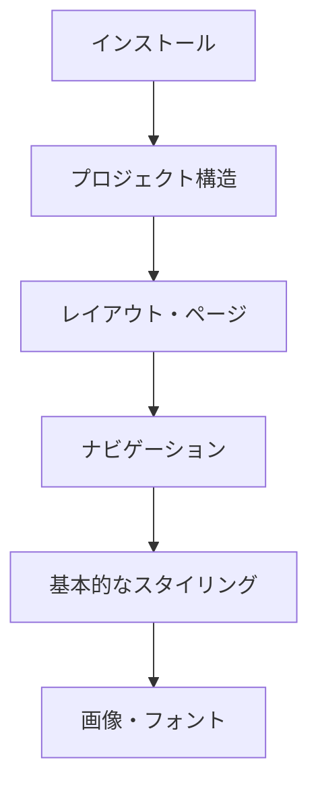
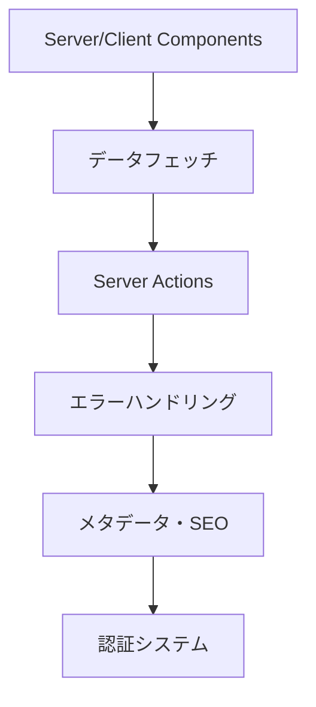
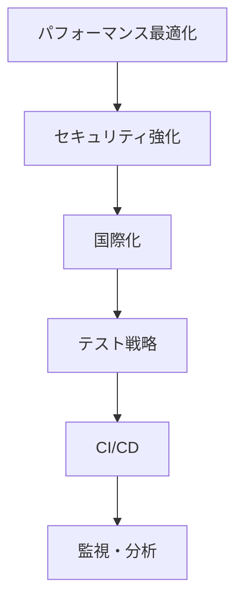

# Next.js App Router Documentation

このドキュメントは、Next.js App Router の包括的なドキュメント集です。LLMが解析・参照しやすいよう、学習から実装、リファレンスまでの全ての要素を体系的に整理しています。

## 目次

- [学習・入門ガイド](#学習入門ガイド)
- [実践的なガイド集](#実践的なガイド集)
- [APIリファレンス](#apiリファレンス)
- [学習パスとロードマップ](#学習パスとロードマップ)
- [実装パターン集](#実装パターン集)

---

## 学習・入門ガイド

### 📚 [`Getting Started`](./getting-started.md)

Next.js App Router の基礎から応用まで、段階的に学習できる包括的な入門ガイド集。

#### 🚀 **基本セットアップ**

**[インストールとプロジェクト作成](./getting-started/00-installation.md)**

- `create-next-app` による最新プロジェクト作成
- TypeScript、Tailwind CSS、ESLint の統合設定
- 開発サーバーの起動と基本的なワークフロー

**[プロジェクト構造の理解](./getting-started/01-project-structure.md)**

- App Router の新しいディレクトリ構造
- ファイル規約と特別な意味を持つファイル名
- Pages Router からの移行ポイント

#### 🏗️ **核となる概念**

**[レイアウトとページの設計](./getting-started/02-layouts-and-pages.md)**

```typescript
// app/layout.tsx - ルートレイアウト
export default function RootLayout({
  children,
}: {
  children: React.ReactNode
}) {
  return (
    <html lang="ja">
      <body>
        <nav>共通ナビゲーション</nav>
        {children}
        <footer>共通フッター</footer>
      </body>
    </html>
  )
}

// app/dashboard/layout.tsx - ネストしたレイアウト
export default function DashboardLayout({
  children,
}: {
  children: React.ReactNode
}) {
  return (
    <div className="dashboard">
      <aside>サイドバー</aside>
      <main>{children}</main>
    </div>
  )
}
```

**[ナビゲーションの実装](./getting-started/03-linking-and-navigating.md)**

```typescript
import Link from 'next/link'
import { useRouter } from 'next/navigation'

// 宣言的ナビゲーション
<Link href="/dashboard" prefetch={true}>
  ダッシュボード
</Link>

// プログラム的ナビゲーション
function LoginButton() {
  const router = useRouter()

  const handleLogin = async () => {
    await authenticate()
    router.push('/dashboard')
  }

  return <button onClick={handleLogin}>ログイン</button>
}
```

**[Server vs Client Components](./getting-started/04-server-and-client-components.md)**

```typescript
// サーバーコンポーネント（デフォルト）
async function BlogPost({ params }: { params: { slug: string } }) {
  const post = await getPost(params.slug)  // サーバーサイドでデータフェッチ
  return (
    <article>
      <h1>{post.title}</h1>
      <div>{post.content}</div>
    </article>
  )
}

// クライアントコンポーネント
'use client'
function InteractiveComponent() {
  const [count, setCount] = useState(0)

  return (
    <button onClick={() => setCount(c => c + 1)}>
      カウント: {count}
    </button>
  )
}
```

#### ⚡ **高度な機能**

**[Partial Prerendering（実験的）](./getting-started/05-partial-prerendering.md)**

```typescript
// 静的・動的コンテンツの最適な組み合わせ
export default async function ProductPage({ params }) {
  return (
    <div>
      {/* 静的部分 - ビルド時に生成 */}
      <ProductDetails productId={params.id} />

      {/* 動的部分 - リクエスト時に生成 */}
      <Suspense fallback={<ReviewsSkeleton />}>
        <ProductReviews productId={params.id} />
      </Suspense>

      {/* 静的部分 */}
      <RelatedProducts productId={params.id} />
    </div>
  )
}
```

**[データフェッチ戦略](./getting-started/06-fetching-data.md)**

```typescript
// サーバーコンポーネントでのフェッチ
async function Posts() {
  const posts = await fetch('https://api.example.com/posts', {
    cache: 'force-cache',  // 静的生成
  })

  return (
    <div>
      {posts.map(post => (
        <PostCard key={post.id} post={post} />
      ))}
    </div>
  )
}

// 動的データ
async function UserDashboard() {
  const user = await fetch('/api/user', {
    cache: 'no-store',  // 常に最新データ
  })

  return <DashboardContent user={user} />
}
```

**[Server Actions によるデータ更新](./getting-started/07-updating-data.md)**

```typescript
'use server'
import { revalidatePath } from 'next/cache'

export async function createPost(formData: FormData) {
  const title = formData.get('title')
  const content = formData.get('content')

  await db.post.create({
    data: { title, content }
  })

  revalidatePath('/posts')  // キャッシュ無効化
}

// フォームでの使用
export default function CreatePostForm() {
  return (
    <form action={createPost}>
      <input name="title" placeholder="タイトル" />
      <textarea name="content" placeholder="内容" />
      <button type="submit">投稿作成</button>
    </form>
  )
}
```

#### 🎨 **UI・UX の実装**

**[エラーハンドリング](./getting-started/09-error-handling.md)**

```typescript
// error.tsx - エラーバウンダリ
'use client'
export default function Error({
  error,
  reset,
}: {
  error: Error & { digest?: string }
  reset: () => void
}) {
  return (
    <div>
      <h2>エラーが発生しました</h2>
      <button onClick={() => reset()}>再試行</button>
    </div>
  )
}

// not-found.tsx - 404ページ
export default function NotFound() {
  return (
    <div>
      <h2>ページが見つかりません</h2>
      <Link href="/">ホームに戻る</Link>
    </div>
  )
}
```

**[スタイリング](./getting-started/10-css.md)**

```typescript
// Tailwind CSS
<div className="bg-blue-500 text-white p-4 rounded-lg">
  Tailwindスタイル
</div>

// CSS Modules
import styles from './component.module.css'
<div className={styles.container}>CSS Modules</div>

// Global CSS
// globals.css
.custom-button {
  @apply bg-blue-500 hover:bg-blue-600 px-4 py-2 rounded;
}
```

**[画像最適化](./getting-started/11-images.md)**

```typescript
import Image from 'next/image'

// レスポンシブ画像
<Image
  src="/hero.jpg"
  alt="Hero画像"
  fill
  priority
  sizes="(max-width: 768px) 100vw, 50vw"
  className="object-cover"
/>

// 固定サイズ画像
<Image
  src="/profile.jpg"
  alt="プロフィール"
  width={200}
  height={200}
  placeholder="blur"
  blurDataURL="data:image/jpeg;base64,..."
/>
```

#### 📈 **SEO・メタデータ**

**[メタデータとOG画像](./getting-started/13-metadata-and-og-images.md)**

```typescript
// 静的メタデータ
export const metadata: Metadata = {
  title: "ブログ | マイサイト",
  description: "最新の技術記事をお届けします",
  openGraph: {
    title: "ブログ",
    description: "最新の技術記事",
    images: ["/og-image.jpg"],
  },
};

// 動的メタデータ
export async function generateMetadata({ params }): Promise<Metadata> {
  const post = await getPost(params.slug);

  return {
    title: post.title,
    description: post.excerpt,
    openGraph: {
      title: post.title,
      description: post.excerpt,
      images: [post.coverImage],
    },
  };
}
```

---

## 実践的なガイド集

### 🛠️ [`Guides`](./guides.md)

実際のプロジェクトで使える実装パターンと解決策の包括的なコレクション。

#### 📊 **パフォーマンス最適化**

**[Analytics実装](./guides/01-analytics.md)**

- Web Vitals 自動追跡とカスタム指標
- Google Analytics、Vercel Analytics 統合
- リアルタイムパフォーマンス監視

**[キャッシング戦略](./guides/04-caching.md)**

```typescript
// 4つのキャッシングレイヤー
// 1. リクエストメモ化
const data1 = await fetch('/api/data')  // 初回リクエスト
const data2 = await fetch('/api/data')  // メモ化された結果

// 2. データキャッシュ
await fetch('/api/posts', {
  next: { revalidate: 3600 }  // 1時間でキャッシュ更新
})

// 3. フルルートキャッシュ（静的生成）
export const revalidate = 3600

// 4. Router キャッシュ（クライアント）
<Link href="/posts" prefetch={true}>Posts</Link>
```

#### 🔒 **セキュリティ**

**[認証システム](./guides/02-authentication.md)**

```typescript
// NextAuth.js統合
import NextAuth from "next-auth";
import GoogleProvider from "next-auth/providers/google";

export const { handlers, auth, signIn, signOut } = NextAuth({
  providers: [
    GoogleProvider({
      clientId: process.env.GOOGLE_CLIENT_ID,
      clientSecret: process.env.GOOGLE_CLIENT_SECRET,
    }),
  ],
  callbacks: {
    session: ({ session, token }) => ({
      ...session,
      user: {
        ...session.user,
        id: token.sub,
      },
    }),
  },
});
```

**[Content Security Policy](./guides/06-content-security-policy.md)**

```javascript
// next.config.js
const cspHeader = `
    default-src 'self';
    script-src 'self' 'unsafe-eval' 'unsafe-inline';
    style-src 'self' 'unsafe-inline';
    img-src 'self' blob: data:;
    font-src 'self';
    object-src 'none';
    base-uri 'self';
    form-action 'self';
    frame-ancestors 'none';
    upgrade-insecure-requests;
`;

module.exports = {
  async headers() {
    return [
      {
        source: "/(.*)",
        headers: [
          {
            key: "Content-Security-Policy",
            value: cspHeader.replace(/\n/g, ""),
          },
        ],
      },
    ];
  },
};
```

#### 🌐 **国際化・多言語対応**

**[Internationalization](./guides/16-internationalization.md)**

```typescript
// app/[lang]/layout.tsx
import { getDictionary } from './dictionaries'

export default async function Layout({
  children,
  params: { lang },
}: {
  children: React.ReactNode
  params: { lang: string }
}) {
  const dict = await getDictionary(lang)

  return (
    <html lang={lang}>
      <body>
        <nav>
          <Link href={`/${lang}/about`}>
            {dict.navigation.about}
          </Link>
        </nav>
        {children}
      </body>
    </html>
  )
}
```

#### 🚀 **デプロイメント**

**[Production Checklist](./guides/27-production-checklist.md)**

- パフォーマンス最適化チェックリスト
- セキュリティ設定の確認
- SEO・アクセシビリティ対応
- 監視・ログ設定

---

## APIリファレンス

### 🔧 [`API Reference`](./api-reference.md)

Next.js App Router のすべてのAPI、関数、コンポーネントの完全なリファレンス。

#### **主要カテゴリ**

1. **[ランタイム環境](./api-reference.md#ランタイム環境)**
   - Edge Runtime: 軽量で高速なエッジ実行環境
   - Turbopack: Rust製高速バンドラー

2. **[CLI](./api-reference.md#cliコマンドラインインターフェース)**
   - create-next-app: プロジェクト作成ツール
   - next CLI: 開発・ビルド・デプロイコマンド

3. **[設定](./api-reference.md#設定configuration)**
   - next.config.js: 58個の設定オプション
   - TypeScript: 型安全な開発環境

4. **[ファイル規約](./api-reference.md#ファイル規約file-conventions)**
   - page.tsx, layout.tsx, error.tsx等の特別なファイル
   - [slug], (...), @folder等の動的ルーティング

5. **[React コンポーネント](./api-reference.md#react-コンポーネント)**
   - Image: 自動最適化画像コンポーネント
   - Link: 高速ナビゲーション
   - Script: サードパーティスクリプト最適化

6. **[関数・フック](./api-reference.md#サーバークライアント関数)**
   - 35個のサーバーサイド関数とクライアントサイドフック
   - fetch, cookies, headers, redirect等の豊富なAPI

---

## 学習パスとロードマップ

### 🎯 **レベル別学習パス**

#### **初心者 (0-1ヶ月)**



1. **基本セットアップ**: インストール→プロジェクト構造→レイアウト・ページ
2. **ナビゲーション**: Link コンポーネント→プログラム的ナビゲーション
3. **スタイリング**: Tailwind CSS→CSS Modules→画像・フォント最適化

#### **中級者 (1-3ヶ月)**



1. **コンポーネント設計**: Server vs Client Components→データフェッチ
2. **データ管理**: Server Actions→キャッシング→再検証
3. **プロダクション準備**: エラーハンドリング→メタデータ→認証

#### **上級者 (3-6ヶ月)**



1. **最適化**: PPR→Analytics→キャッシング戦略
2. **スケーリング**: 国際化→マルチテナント→マイクロフロントエンド
3. **運用**: テスト自動化→CI/CD→監視・ログ

---

## 実装パターン集

### 🏗️ **アーキテクチャパターン**

#### **ディレクトリ構造例**

```
app/
├── (auth)/                 # ルートグループ（URL影響なし）
│   ├── login/
│   │   └── page.tsx
│   └── register/
│       └── page.tsx
├── (dashboard)/            # 認証が必要なエリア
│   ├── layout.tsx          # 認証レイアウト
│   ├── page.tsx
│   ├── settings/
│   └── analytics/
├── blog/
│   ├── page.tsx            # ブログ一覧
│   ├── [slug]/
│   │   ├── page.tsx        # 記事詳細
│   │   └── opengraph-image.tsx
│   └── category/
│       └── [category]/
│           └── page.tsx
├── api/                    # API Routes
│   ├── auth/
│   │   └── route.ts
│   ├── posts/
│   │   ├── route.ts
│   │   └── [id]/
│   │       └── route.ts
│   └── webhook/
│       └── route.ts
├── globals.css
├── layout.tsx              # ルートレイアウト
├── loading.tsx             # グローバルローディング
├── error.tsx              # グローバルエラー
├── not-found.tsx          # 404ページ
└── page.tsx               # ホームページ
```

#### **データフェッチパターン**

```typescript
// 1. 静的データ（ビルド時）
async function StaticPosts() {
  const posts = await fetch('/api/posts', {
    cache: 'force-cache'  // デフォルト
  })
  return <PostList posts={posts} />
}

// 2. 動的データ（リクエスト時）
async function DynamicUserData() {
  const user = await fetch('/api/user', {
    cache: 'no-store'
  })
  return <UserProfile user={user} />
}

// 3. 再検証可能データ（ISR）
async function RevalidatedPosts() {
  const posts = await fetch('/api/posts', {
    next: { revalidate: 3600 }  // 1時間で再検証
  })
  return <PostList posts={posts} />
}

// 4. タグベース再検証
async function TaggedData() {
  const data = await fetch('/api/data', {
    next: { tags: ['posts', 'user'] }
  })
  return <DataComponent data={data} />
}
```

#### **エラーハンドリングパターン**

```typescript
// app/error.tsx - グローバルエラー
'use client'
export default function GlobalError({
  error,
  reset,
}: {
  error: Error & { digest?: string }
  reset: () => void
}) {
  useEffect(() => {
    // エラーログサービスに送信
    console.error(error)
  }, [error])

  return (
    <html>
      <body>
        <h2>何かがうまくいきませんでした！</h2>
        <button onClick={() => reset()}>再試行</button>
      </body>
    </html>
  )
}

// app/dashboard/error.tsx - セクション固有エラー
'use client'
export default function DashboardError({ error, reset }) {
  return (
    <div className="error-container">
      <h2>ダッシュボードエラー</h2>
      <details>
        <summary>エラー詳細</summary>
        <pre>{error.message}</pre>
      </details>
      <button onClick={reset}>再試行</button>
    </div>
  )
}
```

### 🔄 **状態管理パターン**

#### **Server State vs Client State**

```typescript
// サーバーステート - データフェッチ
async function ServerStateComponent() {
  const posts = await getPosts()  // サーバーサイドで取得

  return (
    <div>
      {posts.map(post => (
        <PostCard key={post.id} post={post} />
      ))}
    </div>
  )
}

// クライアントステート - UI状態
'use client'
function ClientStateComponent() {
  const [isOpen, setIsOpen] = useState(false)
  const [formData, setFormData] = useState({})

  return (
    <div>
      <button onClick={() => setIsOpen(!isOpen)}>
        {isOpen ? '閉じる' : '開く'}
      </button>
      {isOpen && <Modal />}
    </div>
  )
}

// ハイブリッド - サーバーデータ + クライアント状態
async function HybridComponent({ searchParams }) {
  const initialPosts = await getPosts(searchParams)

  return (
    <div>
      <SearchFilters />  {/* クライアントコンポーネント */}
      <PostList initialPosts={initialPosts} />
    </div>
  )
}
```

---

## 最新機能と実験的機能

### ⚡ **Partial Prerendering (PPR)**

```typescript
// 静的・動的コンテンツの最適な混在
export default async function ProductPage() {
  return (
    <div>
      {/* 静的部分 - ビルド時生成 */}
      <ProductHeader />
      <ProductDescription />

      {/* 動的部分 - ストリーミング */}
      <Suspense fallback={<PriceSkeleton />}>
        <ProductPrice />  {/* 動的価格情報 */}
      </Suspense>

      <Suspense fallback={<ReviewsSkeleton />}>
        <ProductReviews />  {/* ユーザーレビュー */}
      </Suspense>

      {/* 静的部分 */}
      <RelatedProducts />
    </div>
  )
}
```

### 🦀 **Turbopack Integration**

```json
// package.json
{
  "scripts": {
    "dev": "next dev --turbopack",
    "build": "next build",
    "start": "next start"
  }
}
```

### 🎯 **React 19 Features**

```typescript
// Server Components での async/await
async function AsyncServerComponent() {
  const data = await fetchData()
  return <div>{data}</div>
}

// use() hook for promises
'use client'
function ClientComponent({ dataPromise }) {
  const data = use(dataPromise)  // React 19の新機能
  return <div>{data}</div>
}
```

---

このドキュメントは、Next.js App Router の学習から実装まで、あらゆる段階で参照できる包括的なガイドです。初心者から上級者まで、それぞれのレベルに応じた学習パスを提供し、実際のプロジェクトで使える実装パターンと解決策を豊富に含んでいます。各セクションの詳細については、個別のリンク先ドキュメントを参照してください。
