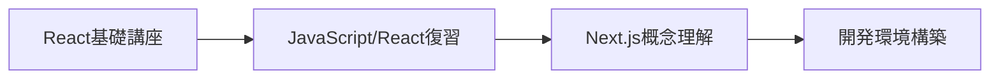
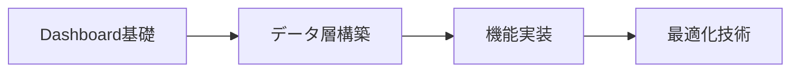
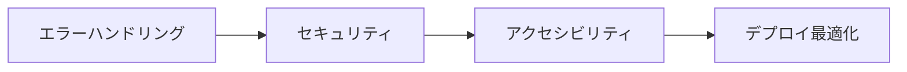

# Next.js Learn - 学習コース

Next.jsの包括的な学習コースコレクション。ReactとNext.jsの基礎から本格的なフルスタックアプリケーション開発まで段階的に学習できます。

## 📚 目次

1. [React基礎講座](#react基礎講座)
2. [Dashboard App 構築コース](#dashboard-app-構築コース)
3. [学習パス推奨](#学習パス推奨)
4. [関連リンク](#関連リンク)

---

## React基礎講座

Next.jsの前提知識として必要なReactとWebアプリケーション開発の基礎を段階的に学習するコース。

### 📖 [React Foundations コース](./learn/react-foundations.md)

#### コース概要

- **対象**: JavaScript初心者からNext.js学習希望者
- **前提知識**: HTML、CSS、JavaScriptの基礎
- **システム要件**: Node.js 20.12.0以降、テキストエディタ
- **学習方法**: 実例中心、段階的構築

#### 学習章構成（11章）

**基礎理解（第0-2章）**

- **[00. Introduction](./learn/react-foundations/00-Introduction.md)** - コース概要と前提知識
- **[01. ReactとNext.jsについて](./learn/react-foundations/01-what-is-react-and-nextjs.md)** - Webアプリケーションの構成要素とライブラリ・フレームワークの役割
- **[02. UIのレンダリング](./learn/react-foundations/02-rendering-ui.md)** - HTMLからDOMへの変換とブラウザレンダリング

**JavaScript DOM操作（第3章）**

- **[03. JavaScriptでUIを更新する](./learn/react-foundations/03-updating-ui-with-javascript.md)** - DOMメソッドによる動的UI操作実践

**React基礎（第4-7章）**

- **[04. Reactを始める](./learn/react-foundations/04-getting-started-with-react.md)** - ReactのCDN導入とJSX基本
- **[05. コンポーネントでUIを構築する](./learn/react-foundations/05-building-ui-with-components.md)** - コンポーネントシステムとモジュール性
- **[06. Propsを使ったデータの表示](./learn/react-foundations/06-displaying-data-with-props.md)** - コンポーネント間データ受け渡し
- **[07. ステートによるインタラクティビティの追加](./learn/react-foundations/07-updating-state.md)** - React.useState()フックによる状態管理

**Next.js移行（第8-11章）**

- **[08. ReactからNext.jsへ](./learn/react-foundations/08-from-react-to-nextjs.md)** - Reactアプリケーションの統合と総復習
- **[09. Next.jsのインストール](./learn/react-foundations/09-installation.md)** - 開発環境セットアップとパッケージ管理
- **[10. サーバーとクライアントコンポーネント](./learn/react-foundations/10-server-and-client-components.md)** - SSRとRSCの概念理解
- **[11. 次のステップ](./learn/react-foundations/11-next-steps.md)** - 継続学習リソースと実践プロジェクト案内

#### 学習成果・習得スキル

```typescript
// 習得技術スタック
interface ReactFoundationsSkills {
  javascript: {
    domManipulation: "getElementById, createElement等の活用";
    eventHandling: "ユーザーインタラクション処理";
    es6Plus: "モダンJavaScript構文理解";
  };
  react: {
    jsx: "JSX構文の読み書き";
    components: "関数コンポーネントの作成と再利用";
    props: "コンポーネント間データ受け渡し";
    state: "useState()による状態管理";
    lifecycle: "基本的なコンポーネントライフサイクル";
  };
  nextjs: {
    concepts: "サーバー・クライアントコンポーネント区別";
    setup: "プロジェクト初期化とパッケージ管理";
    migration: "ReactからNext.jsへの移行プロセス";
  };
  development: {
    nodejs: "Node.js、npm基本操作";
    tooling: "package.json、依存関係管理";
    structure: "プロジェクト構造とファイル組織";
  };
}
```

---

## Dashboard App 構築コース

React基礎を前提とした本格的なフルスタック財務ダッシュボード構築コース。Next.js 14の最新機能を活用した実践的な開発学習。

### 🚀 [Next.js Dashboard App コース](./learn/dashboard-app.md)

#### プロジェクト概要

```typescript
interface DashboardProject {
  application: {
    type: "財務ダッシュボード";
    features: [
      "パブリックホームページ",
      "ログイン機能",
      "認証保護されたダッシュボード",
      "CRUD機能（請求書管理）",
      "レスポンシブデザイン",
    ];
  };
  techStack: {
    framework: "Next.js 14 (App Router)";
    language: "TypeScript";
    styling: "Tailwind CSS";
    database: "PostgreSQL (Vercel)";
    auth: "NextAuth.js";
    deployment: "Vercel";
  };
}
```

#### 学習章構成（18章）

**基礎セットアップ（第0-3章）**

- **[00. イントロダクション](./learn/dashboard-app/00-Introduction.md)** - コース概要、学習目標、最終成果物
- **[01. はじめに](./learn/dashboard-app/01-getting-started.md)** - Next.jsプロジェクト作成、フォルダ構造理解
- **[02. CSSスタイリング](./learn/dashboard-app/02-css-styling.md)** - Tailwind CSS、CSS Modules、グローバルスタイル
- **[03. フォントと画像の最適化](./learn/dashboard-app/03-optimizing-fonts-images.md)** - `next/font`と`next/image`による最適化

**ルーティングと構造（第4-5章）**

- **[04. レイアウトとページの作成](./learn/dashboard-app/04-creating-layouts-and-pages.md)** - ファイルシステムルーティング、ネストレイアウト
- **[05. ページ間のナビゲーション](./learn/dashboard-app/05-navigating-between-pages.md)** - `<Link>`コンポーネント、クライアントサイドナビゲーション

**データベースとデータ処理（第6-8章）**

- **[06. データベースのセットアップ](./learn/dashboard-app/06-setting-up-your-database.md)** - PostgreSQL設定、Vercelデプロイ
- **[07. データの取得](./learn/dashboard-app/07-fetching-data.md)** - Server Components、API vs データベースクエリ
- **[08. 静的および動的レンダリング](./learn/dashboard-app/08-static-and-dynamic-rendering.md)** - レンダリング戦略選択、パフォーマンス最適化

**パフォーマンス最適化（第9-10章）**

- **[09. ストリーミング](./learn/dashboard-app/09-streaming.md)** - `loading.tsx`、Suspenseによる段階的UI読み込み
- **[10. 部分的プリレンダリング](./learn/dashboard-app/10-partial-prerendering.md)** - PPR（実験的機能）による高度最適化

**機能実装（第11-12章）**

- **[11. 検索とページネーション](./learn/dashboard-app/11-adding-search-and-pagination.md)** - URL検索パラメータ、Next.js API活用
- **[12. データの変更](./learn/dashboard-app/12-mutating-data.md)** - Server Actionsによる安全なCRUD操作

**エラーハンドリングとアクセシビリティ（第13-14章）**

- **[13. エラーハンドリング](./learn/dashboard-app/13-error-handling.md)** - `error.tsx`、404エラー、例外処理パターン
- **[14. アクセシビリティの改善](./learn/dashboard-app/14-improving-accessibility.md)** - ESLintプラグイン、フォーム検証、WCAG準拠

**セキュリティとSEO（第15-16章）**

- **[15. 認証の追加](./learn/dashboard-app/15-adding-authentication.md)** - NextAuth.js、Middleware、ルート保護
- **[16. メタデータの追加](./learn/dashboard-app/16-adding-metadata.md)** - SEO最適化、Open Graph、ファビコン設定

**まとめ（第17章）**

- **[17. 次のステップ](./learn/dashboard-app/17-next-steps.md)** - さらなる学習リソース、展開・改善案

#### 技術習得項目

```typescript
interface DashboardSkills {
  nextjs: {
    appRouter: "ファイルシステムベースルーティング";
    serverComponents: "サーバーサイドレンダリング最適化";
    serverActions: "サーバーサイドフォーム処理";
    streaming: "段階的コンテンツ読み込み";
    renderingStrategies: "静的・動的レンダリング戦略";
    experimentalFeatures: "PPR等の最新機能";
  };
  fullstack: {
    database: "PostgreSQL スキーマ設計・接続";
    authentication: "NextAuth.js セキュリティ実装";
    crud: "Server Actions データ操作";
    api: "RESTful API設計・実装";
  };
  frontend: {
    typescript: "型安全なコード記述";
    tailwindcss: "ユーティリティファーストCSS";
    accessibility: "WCAG準拠UI設計";
    responsive: "マルチデバイス対応";
  };
  devops: {
    vercel: "CI/CD パイプライン";
    environment: "環境変数管理";
    performance: "Core Web Vitals 最適化";
    monitoring: "エラートラッキング";
  };
}
```

---

## 学習パス推奨

効率的なNext.js習得のための段階的学習ロードマップ。

### 🎯 学習フロー

#### 🟢 Phase 1: 基礎固め（1-2週間）



**対象**: プログラミング初心者〜JavaScript基礎習得者

- **React Foundations コース（第0-7章）**: 必須
- **習得目標**: コンポーネント、Props、State、JSX
- **実践課題**: シンプルなTodoアプリ作成

#### 🟡 Phase 2: 実践開発（3-4週間）



**対象**: React基礎習得者

- **Dashboard App コース（第0-12章）**: 必須
- **習得目標**: フルスタック開発、データベース連携
- **実践課題**: 財務ダッシュボード完成

#### 🔴 Phase 3: 本番対応（2-3週間）



**対象**: フルスタック開発基礎習得者

- **Dashboard App コース（第13-17章）**: 推奨
- **習得目標**: プロダクション品質、運用考慮
- **実践課題**: 本番環境デプロイ、監視設定

### 📊 学習進捗管理

#### スキルレベル判定

```typescript
interface SkillAssessment {
  beginner: {
    criteria: "HTML/CSS基礎、JavaScript変数・関数理解";
    recommendedPath: "React基礎講座完全履修";
    timeEstimate: "2-3週間";
  };
  intermediate: {
    criteria: "React基礎理解、コンポーネント作成経験";
    recommendedPath: "Dashboard App 基礎〜機能実装";
    timeEstimate: "3-4週間";
  };
  advanced: {
    criteria: "フルスタック開発経験、Next.js基礎知識";
    recommendedPath: "Dashboard App 最適化〜本番対応";
    timeEstimate: "2-3週間";
  };
}
```

#### 学習効果測定

- **週次チェックポイント**: 各章完了時の理解度確認
- **実践プロジェクト**: 習得技術の応用課題
- **コードレビュー**: ベストプラクティス適用確認
- **パフォーマンス測定**: アプリケーション品質評価

---

## 関連リンク

### 📚 公式リソース

- [Next.js Learn Platform](https://nextjs.org/learn) - 公式学習プラットフォーム
- [Next.js Documentation](https://nextjs.org/docs) - 公式ドキュメント
- [React Documentation](https://react.dev) - React公式ドキュメント
- [Vercel Documentation](https://vercel.com/docs) - デプロイプラットフォーム

### 🛠️ 開発ツール・テンプレート

- [Next.js Templates](https://vercel.com/templates/next.js) - 公式プロジェクトテンプレート
- [create-next-app](https://nextjs.org/docs/api-reference/create-next-app) - プロジェクト初期化ツール
- [Tailwind CSS](https://tailwindcss.com) - ユーティリティファーストCSS
- [NextAuth.js](https://next-auth.js.org) - 認証ライブラリ
- [Prisma](https://prisma.io) - データベースORM
- [PostgreSQL](https://www.postgresql.org) - リレーショナルデータベース

### 💬 コミュニティ・サポート

- [Next.js Discord](https://discord.gg/Q3AsD4efFC) - 公式Discordサーバー
- [Vercel Discord](https://discord.gg/vercel) - Vercelコミュニティ
- [Next.js GitHub](https://github.com/vercel/next.js) - ソースコード・Issue報告
- [Next.js Reddit](https://reddit.com/r/nextjs) - コミュニティディスカッション
- [Next.js Discussions](https://github.com/vercel/next.js/discussions) - 技術的質問・提案

### 📖 追加学習リソース

- [Next.js Examples](https://github.com/vercel/next.js/tree/canary/examples) - 実装パターン集
- [Next.js Blog](https://nextjs.org/blog) - 最新情報・技術記事
- [Vercel Guide](https://vercel.com/guides) - デプロイ・運用ガイド
- [React Server Components](https://react.dev/blog/2020/12/21/data-fetching-with-react-server-components) - RSC詳細解説

---

## 実装例とベストプラクティス

### 🔧 プロジェクト構造例

```
next-app/
├── app/                    # App Router (Next.js 13+)
│   ├── (auth)/            # Route Groups
│   ├── dashboard/         # Protected Routes
│   ├── globals.css        # Global Styles
│   ├── layout.tsx         # Root Layout
│   └── page.tsx          # Home Page
├── components/            # Reusable Components
│   ├── ui/               # UI Primitives
│   └── forms/            # Form Components
├── lib/                  # Utilities & Configs
│   ├── auth.ts           # Auth Configuration
│   ├── db.ts             # Database Connection
│   └── utils.ts          # Helper Functions
└── public/               # Static Assets
```

### 📝 コード品質ガイドライン

```typescript
// TypeScript strict mode
interface ComponentProps {
  title: string
  optional?: boolean
}

// Server Component (default)
export default function ServerComponent({ title }: ComponentProps) {
  return <h1>{title}</h1>
}

// Client Component (explicit)
'use client'
import { useState } from 'react'

export function ClientComponent() {
  const [count, setCount] = useState(0)
  return (
    <button onClick={() => setCount(c => c + 1)}>
      Count: {count}
    </button>
  )
}
```

### 🚀 パフォーマンス最適化チェックリスト

- [ ] **画像最適化**: `next/image`使用、適切な形式・サイズ
- [ ] **フォント最適化**: `next/font`によるWebFont読み込み
- [ ] **バンドル最適化**: Tree Shaking、コード分割
- [ ] **レンダリング戦略**: 静的・動的レンダリング適切な選択
- [ ] **キャッシュ戦略**: ISR、データキャッシュ活用
- [ ] **Core Web Vitals**: LCP、FID、CLS測定・改善

### ⚡ 開発効率向上

```bash
# 推奨開発フロー
npm create next-app@latest my-app --typescript --tailwind --eslint --app
cd my-app
npm run dev

# パッケージ管理
npm install @next/font lucide-react
npm install -D @types/node

# ビルドとデプロイ
npm run build
vercel --prod
```

このドキュメントにより、Next.js学習の全体像を把握し、効率的な学習パスを辿ることができます。各学習者のレベルと目標に応じて、適切なコースと学習方法を選択してください。
