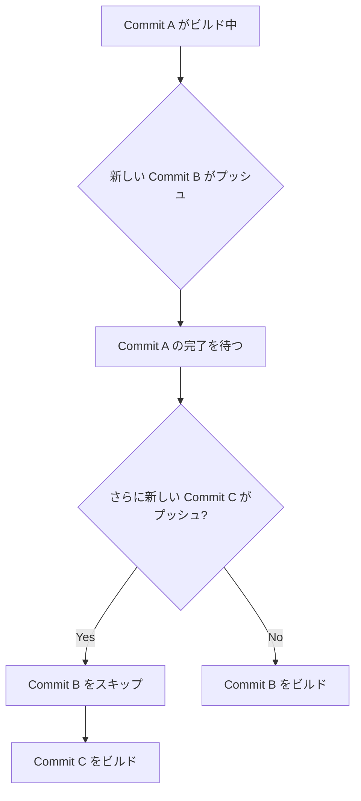

# ビルドキュー

デプロイメントがリソースの利用可能性を待つ仕組み。

## 概要

ビルドキューイングは、デプロイメントがビルドリソースが利用可能になるまで待機する必要がある場合に発生します。

## キューイングのシナリオ

### 1. オンデマンド同時ビルドあり

**推奨設定**

オンデマンド同時ビルドを有効にすると：

- **すべてのビルドキューイングを防止**
- **動的にスケール**: 同時ビルドを動的に拡張
- **高速なデプロイメント**: チーム全体で待機時間なし

```typescript
interface OnDemandBuilds {
  queueing: false;
  dynamicScaling: true;
  recommendation: '推奨';
}
```

### 2. オンデマンド同時ビルドなし

オンデマンド同時ビルドを使用しない場合、2つの主要なキューが管理されます。

## キューの種類

### A. 同時実行キュー（Concurrency Queue）

利用可能なビルドスロットに基づいて並列ビルドを管理します。

#### プランごとの制限

| プラン | 同時ビルド数 |
|--------|--------------|
| Hobby | 1 |
| Pro | 最大12 |
| Enterprise | カスタム制限 |

#### 動作

```typescript
interface ConcurrencyQueue {
  availableSlots: number;
  currentBuilds: number;
  queuedBuilds: number;
}

// 例: Proプラン
const queue: ConcurrencyQueue = {
  availableSlots: 12,
  currentBuilds: 12,
  queuedBuilds: 5  // 5つのビルドが待機中
};
```

#### キュー処理

1. **ビルドスロットが利用可能**
   - キューから次のビルドを開始

2. **すべてのスロットが使用中**
   - 新しいビルドはキューに追加
   - スロットが空くまで待機

### B. Gitブランチキュー（Git Branch Queue）

同じブランチのビルドは順次処理されます。

#### 動作フロー

```typescript
interface BranchQueue {
  branch: string;
  currentBuild: string;
  queuedCommits: string[];
  skippedCommits: string[];
}

// 例
const queue: BranchQueue = {
  branch: 'main',
  currentBuild: 'abc123',
  queuedCommits: ['def456', 'ghi789'],
  skippedCommits: []
};
```

#### スキップロジック

新しいコミットがプッシュされた場合：



**具体例:**

1. **初期状態**: Commit A がビルド中
2. **Commit B プッシュ**: キューに追加
3. **Commit C プッシュ**: Commit B をスキップ、Commit C をキュー
4. **Commit A 完了**: 最新の Commit C をビルド

#### スキップされる理由

- **最新のコミットを優先**: 古いコミットのビルドは不要
- **リソースの最適化**: 不要なビルドを回避
- **デプロイメント効率**: 最新のコードのみをデプロイ

## キューイングの回避方法

### オンデマンド同時ビルドの有効化

**ProおよびEnterpriseプラン**

#### プロジェクトレベルでの設定

1. プロジェクトダッシュボードに移動
2. **Settings** > **General**
3. **Build & Development Settings**
4. **On-Demand Concurrent Builds** を有効化

```json
{
  "settings": {
    "onDemandConcurrentBuilds": true
  }
}
```

#### 料金

使用したビルド分数に基づいて課金されます。

```typescript
interface Pricing {
  model: 'pay-per-use';
  unit: 'build minutes';
  benefit: '無制限の同時ビルド';
}
```

### 緊急ビルドの使用（Enterpriseのみ）

Enterpriseユーザーは、**Urgent On-Demand Concurrency**を使用してGitブランチキューをバイパスできます。

#### 使用方法

1. デプロイメント詳細ページに移動
2. **Start Building Now** ボタンをクリック
3. ビルドが即座に開始

```typescript
interface UrgentBuild {
  skipQueue: true;
  immediateStart: true;
  availability: 'Enterprise only';
}
```

## キュー状態の確認

### Vercelダッシュボード

デプロイメントのステータスで確認：

```typescript
interface DeploymentStatus {
  state: 'QUEUED' | 'BUILDING' | 'READY' | 'ERROR';
  queuePosition?: number;
  estimatedTime?: number;
}
```

### ステータスの意味

**QUEUED:**
- ビルドが待機中
- リソースまたはスロットの利用可能性を待っている

**BUILDING:**
- ビルドが進行中
- リソースが割り当てられている

**READY:**
- ビルドとデプロイメントが完了

**ERROR:**
- ビルドが失敗

## 最適化戦略

### 1. オンデマンド同時ビルドの使用

**メリット:**
- キューイングなし
- 高速なデプロイメント
- チームの生産性向上

**適用場面:**
- 活発な開発フェーズ
- 大規模チーム
- 頻繁なデプロイメント

### 2. ビルド時間の最適化

```json
{
  "scripts": {
    "build": "next build"
  },
  "cacheDirectories": [
    ".next/cache",
    "node_modules"
  ]
}
```

**メリット:**
- ビルドスロットの占有時間を短縮
- より多くのビルドを処理可能

### 3. プロダクションビルドの優先順位付け

```json
{
  "github": {
    "autoAlias": false
  }
}
```

プレビューデプロイメントを制限して、プロダクションビルドを優先します。

### 4. ブランチ戦略の最適化

**推奨:**

```
main          ← プロダクション
  ├─ develop  ← 開発
  │   ├─ feature/a
  │   └─ feature/b
  └─ hotfix/x
```

- 各ブランチに個別のキュー
- ブランチ間で並列ビルド可能

### 5. コミット戦略

**避けるべき:**
```bash
# 短時間に複数の小さなコミット
git commit -m "fix typo"
git push
git commit -m "fix another typo"
git push
```

**推奨:**
```bash
# まとまった変更をコミット
git commit -m "Fix multiple typos and update docs"
git push
```

## モニタリング

### ビルドキューのメトリクス

```typescript
interface BuildMetrics {
  totalBuilds: number;
  queuedBuilds: number;
  averageQueueTime: number;  // 秒
  averageBuildTime: number;  // 秒
  concurrentBuilds: number;
}
```

### 分析すべき指標

1. **キュー時間**
   - 平均待機時間
   - 最大待機時間

2. **ビルド時間**
   - 平均ビルド時間
   - 長時間ビルドの特定

3. **スキップ率**
   - スキップされたビルドの数
   - 頻繁にスキップされるブランチ

## トラブルシューティング

### ビルドが長時間キューに滞在

**原因:**
- すべてのビルドスロットが使用中
- 他のビルドが長時間実行中

**解決策:**
1. オンデマンド同時ビルドを有効化
2. 長時間ビルドを最適化
3. 不要なビルドをキャンセル

### ビルドがスキップされる

**原因:**
- 同じブランチに新しいコミットがプッシュされた

**解決策:**
1. コミットを集約
2. 重要なビルドには別ブランチを使用
3. 緊急ビルドを使用（Enterpriseのみ）

### 同時ビルド制限に達する

**原因:**
- プランの同時ビルド制限に達している

**解決策:**
1. ProまたはEnterpriseプランにアップグレード
2. オンデマンド同時ビルドを有効化
3. ビルド時間を最適化

## ベストプラクティス

1. **オンデマンド同時ビルドの有効化**
   - ProまたはEnterpriseプランでは推奨

2. **ビルドの最適化**
   - キャッシュの活用
   - 依存関係の最小化
   - 並列ビルドの使用

3. **ブランチ戦略**
   - 明確なブランチ構造
   - 不要なブランチの削除

4. **コミット戦略**
   - まとまった変更をコミット
   - 頻繁な小さなコミットを避ける

5. **モニタリング**
   - ビルド時間を定期的に確認
   - キュー時間を監視

## 関連リンク

- [ビルド概要](/docs/builds)
- [ビルドの管理](/docs/builds/managing-builds)
- [ビルドの設定](/docs/builds/configure-a-build)
- [プランと価格](https://vercel.com/pricing)
